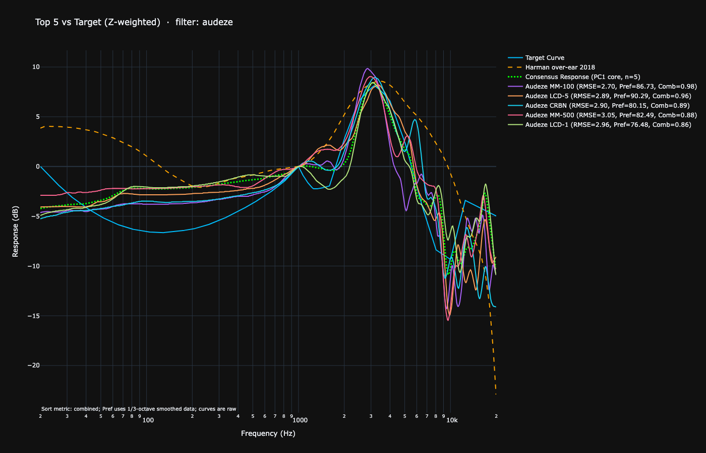

# ResponseRank



Rank headphone frequency response measurements by how closely they match a target curve (e.g., [Headphone_Target](https://github.com/MrChillStorm/Headphone_Target)).
Closeness is calculated using **root-mean-square error (RMSE)** between the interpolated measurement and the target response.

The script also computes a **preference score** based on the AES 2018 model for headphone preference:

> Olive, S., Welti, T., & McMullin, E. (2018).
> *A Statistical Model that Predicts Listeners' Preference Ratings of Around-Ear and On-Ear Headphones*.
> AES Convention: 144, Paper Number: 9919, Publication Date: 2018-05-06.
> [AES e-Library link](https://aes2.org/publications/elibrary-page/?id=19436)

This model estimates listener preference from headphone frequency response using smoothness and slope metrics.

---

## Features

* Compares all `.csv` measurement files in a folder against a target curve.

* Interpolates measurements to the target frequencies for fair comparison.

* Calculates **RMSE** and **Preference Score** for each headphone.

* Finds **Spearman-optimized combination weights** for RMSE vs. preference.

* Ranks results from closest to furthest.

* Prints a clean, sorted list of rankings in the terminal, including **RMSE, Pref, and Combined scores**.

* Sorting options:

  * **combined** – Spearman-optimized combined score (default)
  * **rmse** – RMSE only
  * **pref** – Preference score only

* Optional RMSE weighting:

  * **Z-weighting** (flat / unweighted, default)
  * **A-weighting** (perceptually relevant at moderate levels)
  * **B-weighting** (medium listening levels)
  * **C-weighting** (for loud/high-level listening)

* **Frequency cutoff**: With `--cutoff`, ranking metrics (RMSE and Preference) are computed only above a specified frequency. A vertical marker is added to the plot at the cutoff. Useful for excluding bass-heavy deviation that dominates RMSE without reflecting treble fidelity.

* **Overlay curves**: With `--overlay`, one or more additional CSV curves are drawn on the plot alongside the target and headphone traces. They are normalized at 1 kHz like everything else, drawn immediately below the target in the legend, and are not part of the ranking in any way. Useful for comparing against a second target at the same time.

* **Tonally balanced top headphones**: With `--all-weightings`, the script runs all four weightings and scores every headphone by its **average normalized rank position** across all of them (Z, A, B, C). The top-N are selected from this combined score, so `--top N` always yields exactly N results.

* **Consensus response**: After ranking, the script computes a consensus frequency response from the top-ranked headphones — the tonal centroid of what those headphones agree on, whatever that may be relative to the target. Computed in both single-weighting and all-weightings modes:

  * With **5 or more headphones** in the top list, the consensus response uses the **first principal component (PC1)** extracted via SVD — the direction of greatest shared variation across the top measurements. PC1 variance explained is printed to terminal.
  * With **4 or fewer headphones**, the consensus response is the **mean** of their normalized responses.
  * No post-processing or smoothing is applied — what you see is the raw PC1 or mean on the target frequency grid, normalized to 0 dB at 1 kHz.
  * Plotted alongside the original target and exported as `Consensus_Response.csv`.

* Interactive Plotly plots:

  * Toggle traces on/off
  * Zoom, pan, and hover for detailed frequency response
  * Combine `--top` and `--ranking` selections in one plot

---

## Requirements

* Python 3.7+
* [pandas](https://pandas.pydata.org/)
* [numpy](https://numpy.org/)
* [scikit-learn](https://scikit-learn.org/) (for regression slope analysis)
* [plotly](https://plotly.com/python/) (for interactive plotting)
* [scipy](https://www.scipy.org/) (for Spearman correlation)

Install dependencies:

```bash
pip install pandas numpy plotly scikit-learn scipy
```

---

## Usage

```bash
python response_rank.py <measurements_dir> <target_csv> [options]
```

### Options

| Option                        | Description                                                                                            |
| ----------------------------- | ------------------------------------------------------------------------------------------------------ |
| `--aweight`                   | Use A-weighting for RMSE                                                                               |
| `--bweight`                   | Use B-weighting for RMSE (medium levels)                                                               |
| `--cweight`                   | Use C-weighting for RMSE                                                                               |
| `--all-weightings`            | Run all weightings (Z, A, B, C) and show **tonally balanced top headphones**                           |
| `--top N`                     | Plot / print the top N ranked headphones                                                               |
| `--ranking R1,R2,...`         | Plot specific ranked items by their rank number                                                        |
| `--sort combined\|rmse\|pref` | Sort the printed rankings by **combined score**, **RMSE**, or **preference score** (default: combined) |
| `--filter REGEX`              | Only include headphones whose filenames match the given regex (case-insensitive)                       |
| `--cutoff HZ`                 | Minimum frequency (Hz) included in ranking metrics (RMSE and Preference)                              |
| `--overlay CSV [CSV ...]`     | One or more CSV files to draw on the plot as reference curves (not used for ranking)                   |
| `-np`, `--no-plot`            | Skip the interactive Plotly plot (useful for batch runs or when only the terminal output is needed)    |

`--top` and `--ranking` can be used together. When combined, ranked selections that fall outside the top-N table are printed in a separate block below it.

---

### Examples

#### Single Weighting

```bash
python response_rank.py \
  ~/git/AutoEq/measurements/oratory1990/data/over-ear \
  ~/git/Headphone_Target/targets/headphone_target_0.3661543.csv \
  --aweight --top 10
```

Ranks by A-weighted RMSE combined with preference scores and plots the top 10. The consensus response is computed from those 10 headphones using PC1 (since n > 4).

---

#### No Plot (terminal output only)

```bash
python response_rank.py \
  ~/git/AutoEq/measurements/oratory1990/data/over-ear \
  ~/git/Headphone_Target/targets/headphone_target_0.3661543.csv \
  --all-weightings --top 20 -np
```

Runs the full ranking and prints results without opening a browser window. Useful for batch runs or when only the terminal output or `Consensus_Response.csv` is needed.

---

#### All Weightings / Tonally Balanced Top

```bash
python response_rank.py \
  ~/git/AutoEq/measurements/oratory1990/data/over-ear \
  ~/git/Headphone_Target/targets/headphone_target_0.3661543.csv \
  --all-weightings --top 10
```

Runs each weighting independently, scores every headphone by its average normalized rank position across all four, and selects the top 10 by that combined score. The consensus response is then computed from these 10 tonally consistent headphones.

---

#### With Frequency Cutoff

```bash
python response_rank.py \
  ~/git/AutoEq/measurements/oratory1990/data/over-ear \
  ~/git/Headphone_Target/targets/headphone_target_0.3661543.csv \
  --all-weightings --top 10 --cutoff 200
```

Ranking metrics are computed only above 200 Hz, excluding bass deviation from RMSE and Preference. A dashed vertical line marks the cutoff on the plot.

---

#### Filtered Search

```bash
python response_rank.py \
  ~/git/AutoEq/measurements/oratory1990/data/over-ear \
  ~/git/Headphone_Target/targets/headphone_target_0.3661543.csv \
  --all-weightings --top 10 --filter akg
```

Only includes headphones with `"akg"` in their filename.

---

#### Inverted Filter

```bash
python response_rank.py \
  ~/git/AutoEq/measurements/oratory1990/data/over-ear \
  ~/git/Headphone_Target/targets/headphone_target_0.3661543.csv \
  --all-weightings --top 10 --filter '^(?!.*akg).*'
```

Excludes any headphone containing `"akg"`.

---

#### Combined Positive + Negative Filter

```bash
python response_rank.py \
  ~/git/AutoEq/measurements/oratory1990/data/over-ear \
  ~/git/Headphone_Target/targets/headphone_target_0.3661543.csv \
  --all-weightings --top 13 \
  --filter '(?=.*akg)(?!.*812)'
```

Selects all AKG headphones but excludes the K812.

---

#### Overlay Curves

```bash
python response_rank.py \
  ~/git/AutoEq/measurements/oratory1990/data/over-ear \
  ~/git/Headphone_Target/targets/headphone_target_0.3661543.csv \
  --all-weightings --top 10 \
  --overlay ~/targets/harman_2018.csv ~/targets/diffuse_field.csv
```

Draws the Harman 2018 and diffuse-field curves on the same plot as the ranked headphones, normalized to 0 dB at 1 kHz. Neither curve affects ranking. Multiple files are separated by spaces; the label shown in the legend is the filename stem.

---

### Sample Output

**Single weighting**

```
Z-weighted → Optimal weights → RMSE=0.70, Pref=0.30, Spearman ρ≈0.8086

Ranked headphones (sorted by combined):
  1. Sennheiser HD 600                                            RMSE= 1.060  Pref≈ 87.57  Combined≈0.987
  2. Sennheiser HE 90 Orpheus                                     RMSE= 1.237  Pref≈ 85.99  Combined≈0.977
  3. Sennheiser HD 6XX                                            RMSE= 1.387  Pref≈ 91.69  Combined≈0.976
  4. Sennheiser HD 650                                            RMSE= 1.387  Pref≈ 91.69  Combined≈0.976
  5. HIFIMAN Sundara (post-2020 earpads)                          RMSE= 1.534  Pref≈ 96.82  Combined≈0.974
  ...

Using PC1-based core response (n=10 > 4).
  PC1 explains 61.3% of variance (PC2: 12.1%, PC3: 8.4%)
Writing consensus response CSV with headers: ['frequency', 'raw']
```

**All weightings / tonally balanced top**

```
Z-weighted → Optimal weights → RMSE=0.70, Pref=0.30, Spearman ρ≈0.8086
...

Top-10 tonally balanced headphones by average normalized rank:

  1. Sennheiser HD 600                               AvgNormalizedRank=0.952
  2. HIFIMAN Sundara (post-2020 earpads)             AvgNormalizedRank=0.941
  3. Sennheiser HD 650                               AvgNormalizedRank=0.938
  ...

Using PC1-based core response (n=10 > 4).
  PC1 explains 58.7% of variance (PC2: 14.2%, PC3: 9.1%)
Writing consensus response CSV with headers: ['frequency', 'raw']
```

---

## Notes

* Measurement and target files must be `.csv` with:

  * **Column 1:** Frequency (Hz)
  * **Column 2:** Response (dB)

* Headers are optional — the script detects and handles headerless files automatically.

* Non-CSV files are ignored automatically.

* Frequencies in measurement and target files **do not need to match** — the script interpolates to the target grid.

---

## Why This Script?

### RMSE

Root-mean-square error summarizes the overall difference between a measurement and the target curve in a **single number**, penalizing large deviations more heavily than smaller ones. It's ideal for ranking headphones by tonal accuracy.

### Preference Score

Based on AES 2018 research, the preference score uses frequency response smoothness and slope deviation to estimate how much listeners are likely to prefer the sound of a headphone.

### Spearman-Optimized Combination

The script finds an **optimal combination of RMSE and preference scores** that maximizes correlation with both metrics across all headphones, producing a robust "best-of-both-worlds" ranking.

### Consensus Response

When 5 or more headphones contribute to the consensus response, the script uses **PC1 from singular value decomposition** (SVD) rather than a simple mean. PC1 captures the direction of greatest shared variation — the tonal contour that the top headphones most strongly agree on — while suppressing idiosyncratic measurement noise that would dilute a naive average. The result is returned as-is on the target frequency grid with no smoothing applied. The proportion of variance explained by PC1 is reported in the terminal output.

### Interpolation

Measurements often have different frequency points than the target. Interpolation ensures a **fair, consistent comparison** across all files.

### Use Cases

* Quickly rank multiple headphone measurements.
* Compare against any reference target (e.g., [Headphone_Target](https://github.com/MrChillStorm/Headphone_Target), Harman 2018, oratory1990 optimum hifi).
* Useful for **reviewers, audio engineers, and enthusiasts** who want automated ranking and visualization.
